# Скриншоты интерфейса

Ниже показаны основные экраны и пользовательские сценарии приложения PeerReview.

## Общие экраны

### Главная страница

Описание возможностей сервиса и краткая статистика. Маршрут: `/`.

### Вход

Форма входа зарегистрированного пользователя. Маршрут: `/login`.

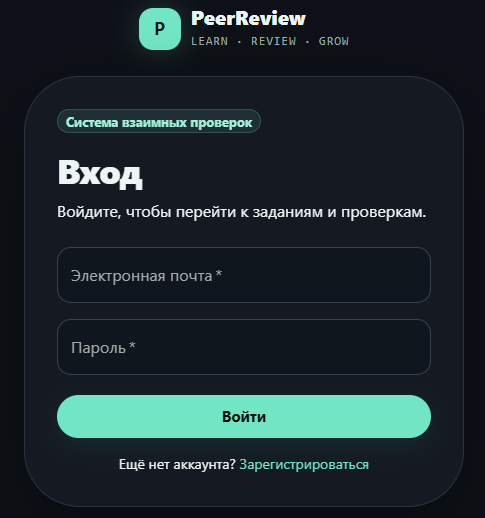

### Регистрация

Создание аккаунта с выбором роли студента или преподавателя. Маршрут: `/register`.

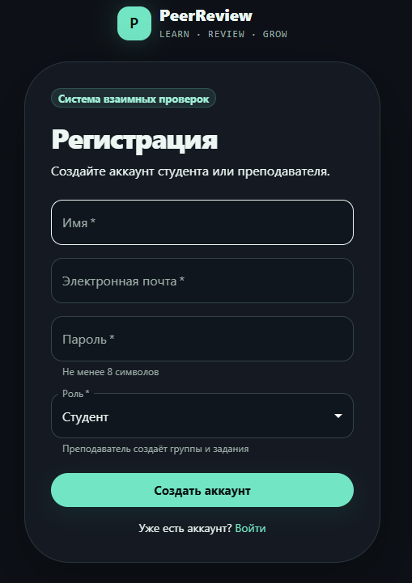

## Экраны преподавателя

### Управление заданиями

Список опубликованных и завершённых заданий преподавателя. Маршрут: `/teacher/assignments`.

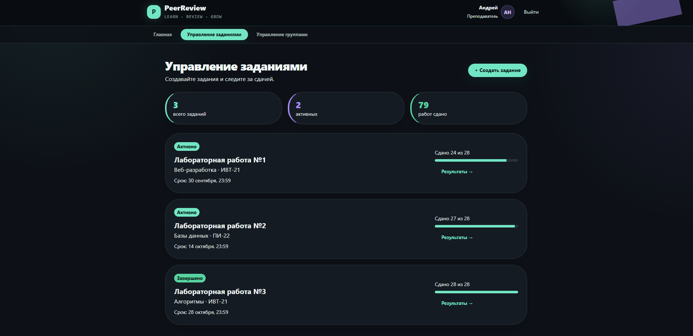

### Результаты задания

Статистика сдачи и проверок, а также результаты студентов. Маршрут: `/teacher/assignments/1`.

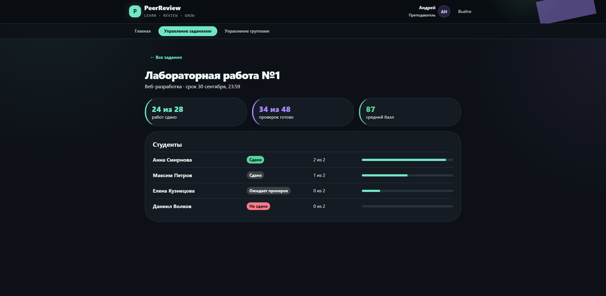

### Создание задания

Форма создания задания для выбранной учебной группы. Маршрут: `/teacher/assignments/new`.

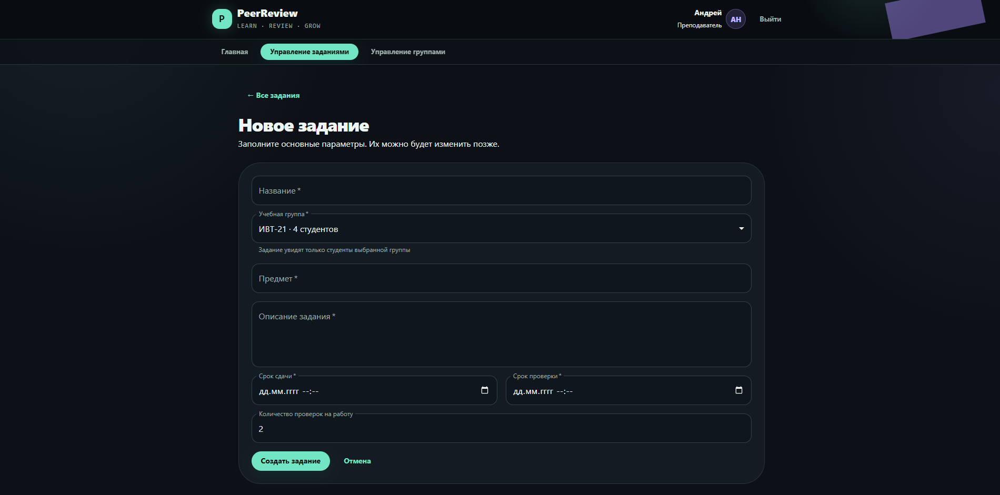

### Управление группами

Список групп преподавателя, коды приглашения и количество заданий. Маршрут: `/teacher/groups`.

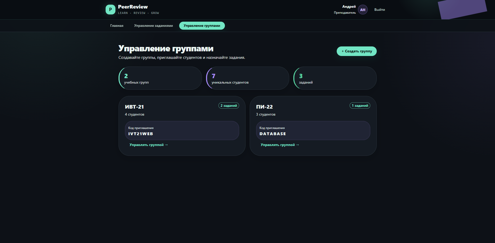

### Создание группы

Форма создания новой учебной группы. Маршрут: `/teacher/groups/new`.

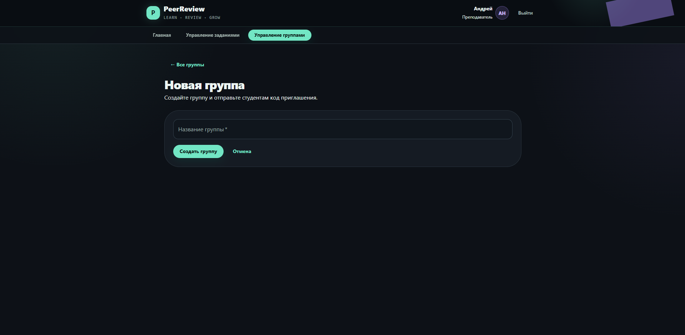

## Экраны студента

### Мои работы

Все доступные студенту задания, их сроки и текущие статусы. Маршрут: `/assignments`.

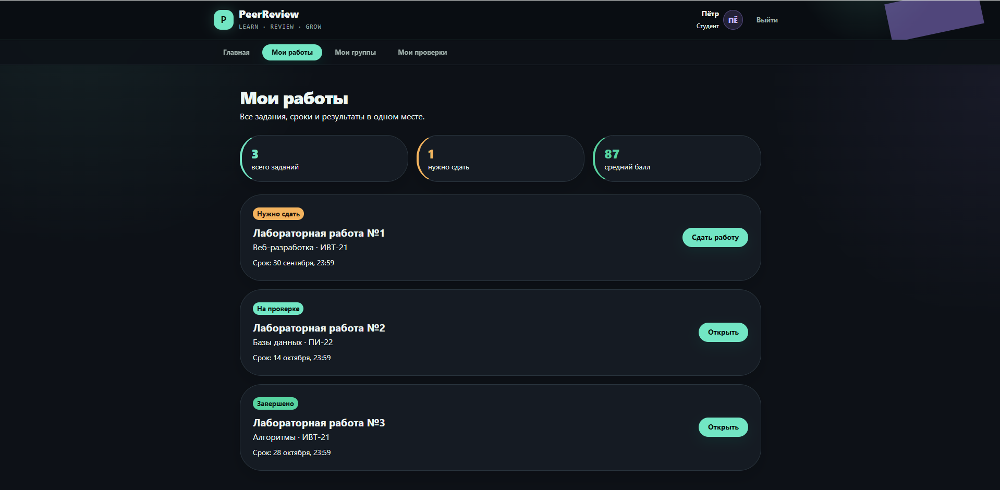

### Отправка работы

Описание задания и форма загрузки выполненной работы. Маршрут: `/assignments/1`.

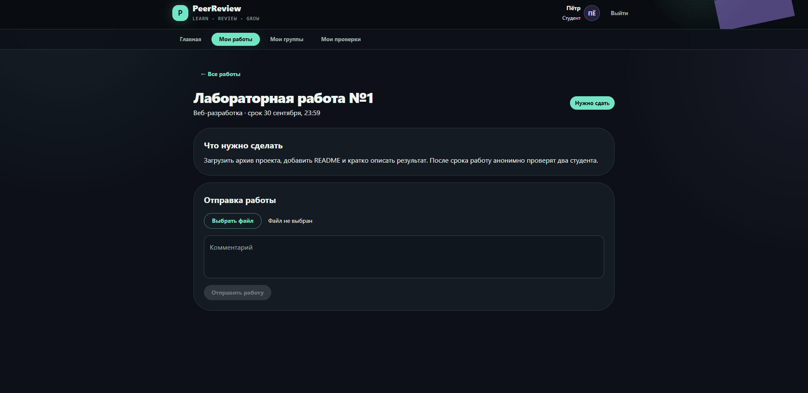

### Мои группы

Вступление по коду приглашения и список групп студента. Маршрут: `/groups`.

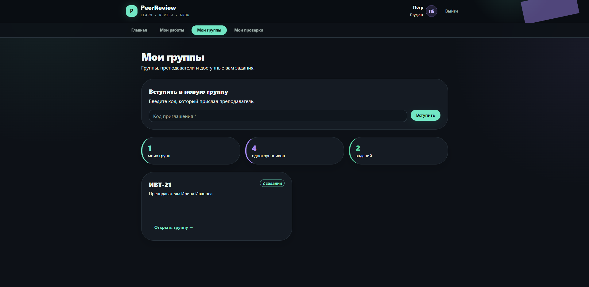

### Страница группы

Информация о группе и назначенные ей задания. Маршрут: `/groups/1`.

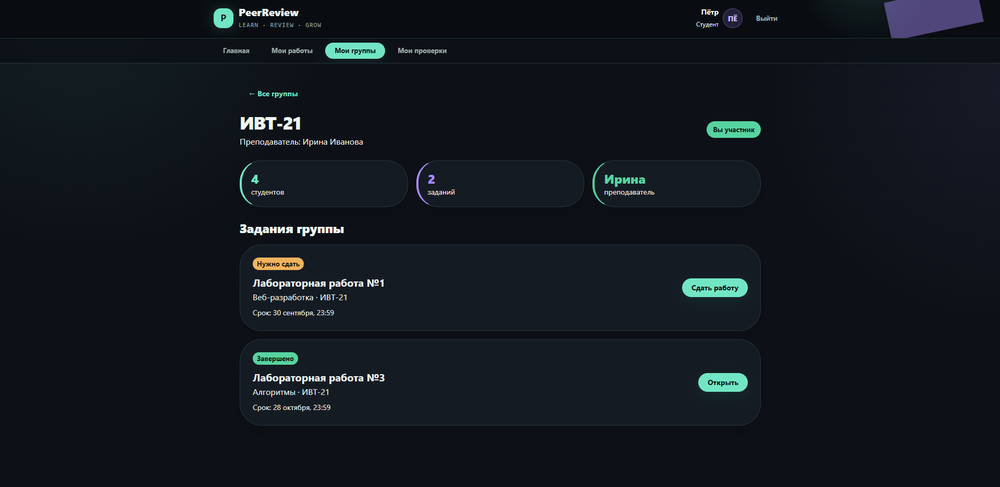

### Мои проверки

Список анонимных проверок с их статусами и сохранёнными комментариями. Маршрут: `/reviews`.

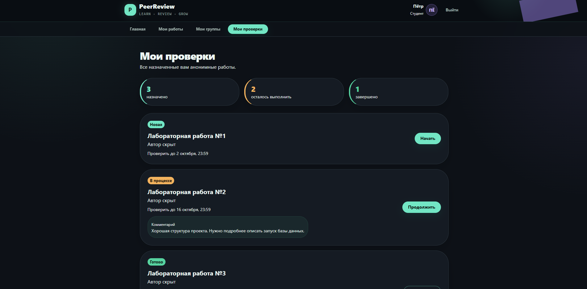
